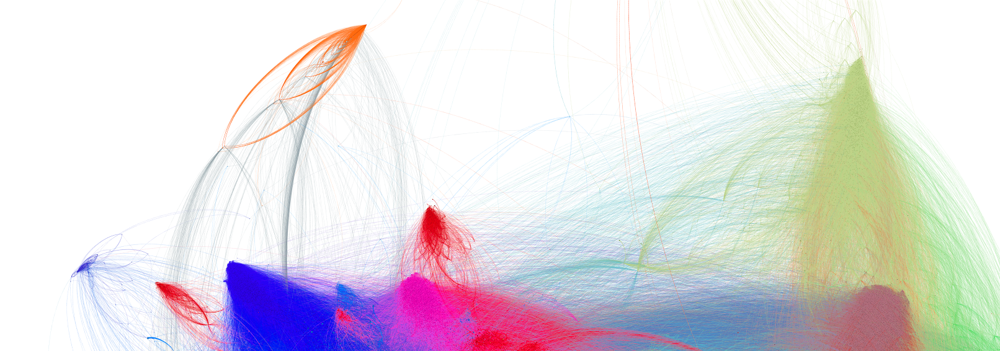

# Twitter community detection

The purpose of this project was to create who-follows-whom graph based on Twitter data and detect communities using most popular community detection algorithms.
The outcome of this project is a graph that has over 100k vertices and over 4 mln edges 

This repository contains set of scripts for:
 - crawling Twitter users data (basic info, followers and most popular hashtags) - taking an initial user, download information about who they follow. Repeat recursively.
 - creating who-follows-whom graph based on crawled data
 - detecting communities in the created graph

# Visualizations

Visualizations where made using [Gephi](https://gephi.org/).

## Whole graph after community detection with modularity:

## Selected communities

### "Hobby" community

Most popular hashtags in this community:

### Multiple small communities

# Authors
 - Karol Bartyzel, 
- Mieszko Makuch

